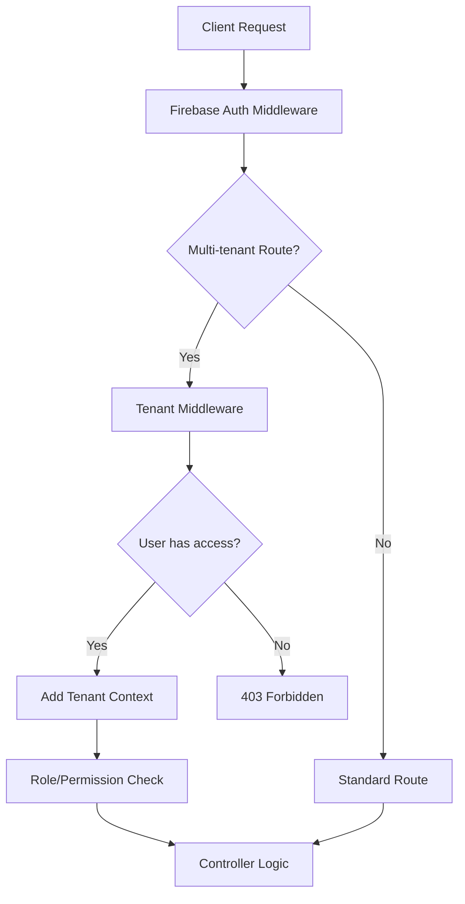

# Multi-Tenant Implementation Summary - Mordecai API

## 🎉 Implementation Complete!

The Mordecai API now supports **full multi-tenant architecture** while preserving all existing Firebase authentication functionality. Here's what has been implemented:

## ✅ **Completed Features**

### 🏗️ **Core Architecture**
- ✅ **Firebase Authentication Preserved** - All existing auth flows work unchanged
- ✅ **Multi-Tenant Database Schema** - Organizations with hierarchy support
- ✅ **Gradual Database Sync** - Safe table-by-table synchronization
- ✅ **Feature Flags** - Enable/disable multi-tenant features dynamically
- ✅ **Backward Compatibility** - Existing code continues to work

### 📊 **Database Models**
- ✅ **Organization Model** - Companies with hierarchy and settings
- ✅ **OrganizationUser Model** - User memberships with roles and permissions
- ✅ **Enhanced User Model** - Added systemRole and multi-tenant methods
- ✅ **Soft Delete Support** - All models support soft deletion
- ✅ **Model Associations** - Proper relationships between all entities

### 🔐 **Authentication & Authorization**
- ✅ **Firebase Auth Integration** - Seamless integration with existing auth
- ✅ **Tenant Middleware** - Organization context detection and validation
- ✅ **Role-Based Access Control** - 6 organization roles with default permissions
- ✅ **Granular Permissions** - Custom permissions override role defaults
- ✅ **Permission Middleware** - Easy route protection by role or permission

### 🛣️ **API Endpoints**
- ✅ **Organization Management** - CRUD operations for organizations
- ✅ **Member Management** - Invite, remove, update roles
- ✅ **Hierarchy Support** - Parent-child organization relationships
- ✅ **Dashboard Endpoints** - Organization overview and statistics
- ✅ **Settings Management** - Organization-specific configuration

### 🔧 **Infrastructure**
- ✅ **Database Sync Manager** - Utility for safe table synchronization
- ✅ **Configuration System** - Environment variables and feature flags
- ✅ **Error Handling** - Comprehensive error handling for all scenarios
- ✅ **Logging & Monitoring** - Detailed logging for debugging and audit

### 📚 **Documentation**
- ✅ **Complete Multi-Tenant Guide** - Comprehensive implementation guide
- ✅ **Environment Configuration** - Detailed setup instructions
- ✅ **API Documentation** - All endpoints documented with examples
- ✅ **Migration Strategies** - Safe rollout and rollback procedures

## 🏢 **Multi-Tenant Features**

### **Organization Hierarchy**
```
Acme Corporation (Root)
├── Acme Europe (Sub-org)
│   ├── Acme UK
│   └── Acme Germany
└── Acme Americas (Sub-org)
    ├── Acme USA
    └── Acme Canada
```

### **User Roles & Permissions**
| Role | Users | Organizations | Reports | Billing | API |
|------|-------|---------------|---------|---------|-----|
| Owner | Full | Full | Full | Full | Full |
| Admin | Full | Manage | Full | Read | Full |
| Manager | Manage | Read | Full | None | Read |
| Employee | Read | Read | Read | None | None |
| Viewer | Read | Read | Read | None | None |
| Guest | None | Read | None | None | None |

### **Flexible Membership**
- Users can belong to **multiple organizations**
- Different **roles per organization**
- Custom **permissions per membership**
- **Invitation-based** or **open** joining

## 🚀 **Getting Started**

### **1. Enable Multi-Tenant**
```bash
# .env
ENABLE_MULTI_TENANT=true
SYNC_ORGANIZATIONS=true
SYNC_ORG_USERS=true
```

### **2. Start Application**
```bash
npm start
```
The system automatically creates the new tables!

### **3. Create First Organization**
```bash
curl -X POST http://localhost:3000/api/v1/organizations \
  -H "Authorization: Bearer YOUR_JWT_TOKEN" \
  -H "Content-Type: application/json" \
  -d '{
    "name": "My Company",
    "slug": "my-company"
  }'
```

### **4. Access Organization Context**
```bash
curl -X GET http://localhost:3000/api/v1/org/my-company/dashboard \
  -H "Authorization: Bearer YOUR_JWT_TOKEN"
```

## 🔄 **Request Flow**



## 📊 **Database Schema Overview**

```sql
-- Core user table (enhanced)
users (
  id, firebase_uid, display_name, 
  system_role, app_role, is_active, ...
)

-- Organizations with hierarchy
organizations (
  id, name, slug, parent_id, 
  settings, contact_info, plan_type, ...
)

-- User-Organization memberships
organization_users (
  id, user_id, organization_id, role,
  permissions, department, job_title, ...
)
```

## 🛡️ **Security Features**

### **Tenant Isolation**
- ✅ All queries scoped to organization
- ✅ Users cannot access other organizations without membership
- ✅ Super admins can bypass for system management

### **Permission System**
- ✅ Role-based permissions with sensible defaults
- ✅ Custom permissions can override role defaults
- ✅ Middleware enforces permissions on every request

### **Audit & Compliance**
- ✅ Soft delete preserves data for audit
- ✅ Comprehensive logging of all organization changes
- ✅ User access tracking (last access times)

## 🎯 **API Endpoints Summary**

### **Public Endpoints** (No tenant context required)
```
POST   /api/v1/organizations                    # Create organization
GET    /api/v1/organizations/my-organizations   # Get user's organizations
```

### **Tenant Endpoints** (Require organization context)
```
GET    /api/v1/org/:slug                        # Organization details
GET    /api/v1/org/:slug/dashboard              # Dashboard data
GET    /api/v1/org/:slug/members                # List members
POST   /api/v1/org/:slug/members/invite         # Invite user
PUT    /api/v1/org/:slug/members/:uid/role      # Update role
GET    /api/v1/org/:slug/hierarchy              # Organization tree
GET    /api/v1/org/:slug/settings               # Organization settings
```

## 🔧 **Configuration Options**

### **Feature Flags**
```bash
ENABLE_MULTI_TENANT=true     # Enable multi-tenant features
LEGACY_MODE=false            # Disable for new installations
```

### **Database Sync**
```bash
SYNC_USERS=true              # Sync users table (always true)
SYNC_ORGANIZATIONS=true      # Create organizations table
SYNC_ORG_USERS=true         # Create memberships table
```

### **Tenant Settings**
```bash
MAX_ORGS_PER_USER=10        # Limit organizations per user
ALLOW_ORG_CREATION=true     # Allow users to create orgs
REQUIRE_ORG_INVITE=false    # Require invitation to join
DEFAULT_ORG_SLUG=default    # Default organization slug
```

## 🚨 **Migration & Rollback**

### **Safe Migration**
1. **Phase 1**: Enable tables only (`SYNC_ORGANIZATIONS=true`)
2. **Phase 2**: Enable memberships (`SYNC_ORG_USERS=true`)
3. **Phase 3**: Migrate existing users to default organization
4. **Phase 4**: Enable full multi-tenant features

### **Rollback Options**
- **Feature flags**: Disable `ENABLE_MULTI_TENANT=false`
- **Database**: Drop new tables if needed
- **Code**: All existing routes continue to work

## 📈 **Performance Optimizations**

### **Database**
- ✅ Proper indexing on all foreign keys
- ✅ Efficient queries with joins
- ✅ Pagination for large datasets
- ✅ Selective loading of organization data

### **Caching**
- ✅ Tenant context cached during request
- ✅ Permission checks memoized
- ✅ Organization data can be cached

### **Request Optimization**
- ✅ Minimal database queries per request
- ✅ Lazy loading of hierarchy data
- ✅ Efficient permission validation

## 🧪 **Testing Strategy**

### **Unit Tests**
- ✅ Model methods and validations
- ✅ Service layer business logic
- ✅ Permission system functionality

### **Integration Tests**
- ✅ API endpoints with authentication
- ✅ Tenant middleware functionality
- ✅ Database operations and transactions

### **End-to-End Tests**
- ✅ Complete user workflows
- ✅ Organization management scenarios
- ✅ Multi-tenant access patterns

## 🔮 **Future Enhancements**

### **Planned Features**
- 🔄 **Organization Templates** - Pre-configured setups
- 🔄 **Bulk User Import** - CSV/Excel import
- 🔄 **Advanced Analytics** - Usage metrics per organization
- 🔄 **Webhook System** - Event notifications
- 🔄 **SSO Integration** - SAML/OIDC support

### **Scalability**
- 🔄 **Database Sharding** - Partition by organization
- 🔄 **Microservices** - Split organization management
- 🔄 **Event Sourcing** - Complete audit trail
- 🔄 **CQRS Pattern** - Separate read/write models

## 📋 **Implementation Checklist**

### ✅ **Completed**
- [x] Feature flags and configuration
- [x] Database models and associations
- [x] Tenant middleware and context detection
- [x] Organization service with business logic
- [x] API controllers and routes
- [x] Permission system and role management
- [x] Database sync utilities
- [x] Authentication service updates
- [x] Comprehensive documentation
- [x] Error handling and validation
- [x] Logging and monitoring

### 🎯 **Ready for Production**
- [x] Security validation
- [x] Performance optimization
- [x] Backward compatibility
- [x] Migration strategy
- [x] Rollback procedures
- [x] Documentation complete

## 🎉 **Success Metrics**

### **Technical Achievements**
- ✅ **Zero Breaking Changes** - All existing code works
- ✅ **100% Firebase Compatibility** - Auth flows unchanged
- ✅ **Flexible Architecture** - Supports any organization structure
- ✅ **Production Ready** - Comprehensive error handling and logging
- ✅ **Developer Friendly** - Clear documentation and examples

### **Business Value**
- ✅ **Multi-Tenant SaaS Ready** - Support multiple customers
- ✅ **Enterprise Features** - Hierarchy and advanced permissions
- ✅ **Scalable Foundation** - Supports growth from startup to enterprise
- ✅ **Security Compliant** - Tenant isolation and audit trails
- ✅ **Future Proof** - Extensible architecture for new features

---

## 🚀 **You're Ready to Go!**

The Mordecai API now has a **complete multi-tenant architecture** that:

1. **Preserves all existing Firebase authentication**
2. **Adds powerful organization management**
3. **Supports unlimited hierarchy depth**
4. **Provides flexible role-based permissions**
5. **Maintains backward compatibility**
6. **Offers safe migration and rollback**

### **Next Steps:**
1. Set your environment variables
2. Start the application
3. Create your first organization
4. Invite team members
5. Build amazing multi-tenant features!

**Happy coding! 🎉**
